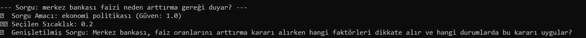
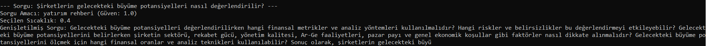
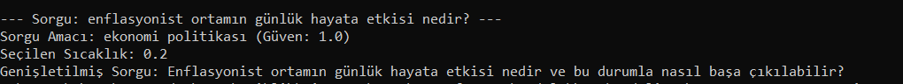

<h1> Genelleştirilmiş Sorgu Oluşturma</h1>
<h3>Proje Hakkında</h3>

 Financial-QueryAnalyzer RAG sistemine entegre edilmesiyle, finans alanında tecrübesi olmayan kullanıcıların finansal sorgularını daha anlamlı ve kapsamlı hale getiren bir araçtır.

      <ul>
        <li>Finansal soruların amacını otomatik olarak kategorize eder.</li>
        <li>Sorguları amaca özgü şablonlar kullanarak genişletir.</li>
        <li>Sorguları vektör temsillerine dönüştürerek semantik arama için hazırlar.</li>
        <li>Intent kategorisine göre optimize edilmiş sıcaklık (temperature) değerleri kullanır.</li>
      </ul>
<h3> Kurulum </h3>
<code>pip install requirements.txt</code>

 .env dosyası oluşturuğ openai api-key ekleyin 

<code> OPENAI_API_KEY="your-api-key"</code>
<h3> Örnekler <h3>

sorgu1

sorgu2

sorgu3

